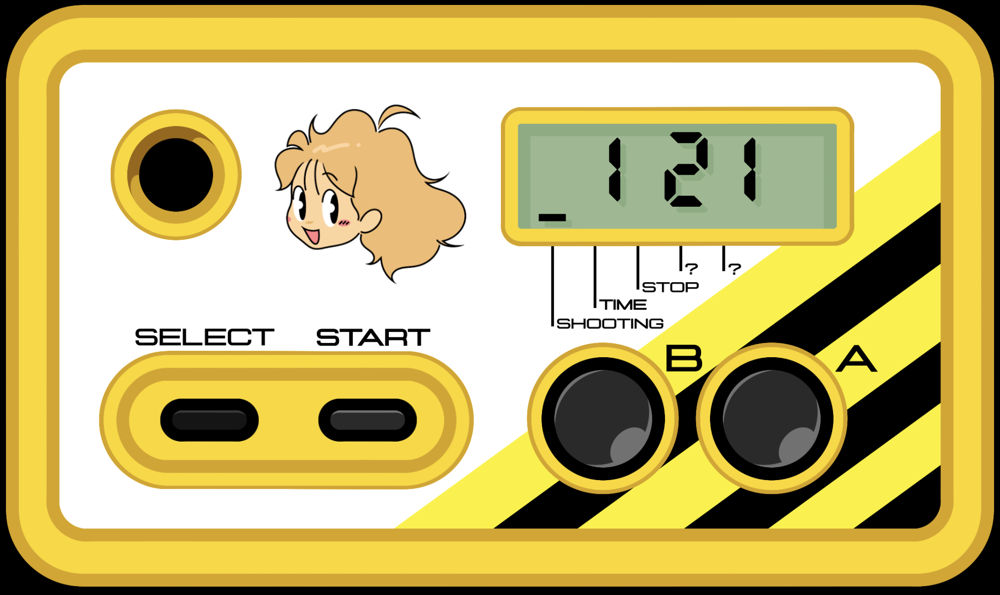

# Shooting Watch (シューティングウォッチ)
**_Aim for 16 shots!_**

## What is it?
The Shooting Watch is a self-proclaimed "rapid-fire measurement device".
Essentially, it's a watch that's been put into a game controller. The main feature
measures **how fast you can hit the A and B buttons within 10 seconds**.

It was originally created by the game company **Hudson Soft** (now owned by Konami) in **1987**.
Hudson Soft released many gaming peripherals with rapid-fire as the main selling point, and 
was advertised for use in shooting games (what we call **shoot-'em-ups** outside of Japan) they developed,
including **Star Force and Star Soldier**.

Hudson Soft and their products became widely famous thanks to the efforts of Takahashi Meijin, or Master Takahashi (real name Toshiyuki Takahashi).
He was the face of Hudson's marketing in their prime and became a celebrity amongst kids, appearing in comic books and television shows.
He even stars in the Japanese version of Hudson's game series **Adventure Island**.

Takahashi Meijin is however best known for his insanely fast trigger finger, once capable of hitting a button around **16 times per second**!
The Shooting Watch tasks you with standing up to the master himself: can you surpass the 16 shot limit?

## Keyboard controls
* A: `a key`
* B: `b key`
* SELECT: `shift key`
* START: `enter key`

## Modes

### 1. Shooting
Your current high score will be shown initially. 

Press start to pull up the 10-second timer.
When you are ready, start mashing the A and/or B buttons as fast as you can until time runs out.

### 2. Time
Gets the current time in 24-hour format.

### 3. Stopwatch
Press A to start timing, and press A again to pause. Press B while paused to reset the stopwatch.

While timing, press B to enter "lap" mode. The mode cursor will blink. The display will freeze at the time the button was pressed. 
Press A while in lap mode to return to the normal stopwatch mode.

### 4. Dice
Rolls three dice, each die ranging from 1 to 6. Press start to roll all dice, and A or B to stop each die.

**This mode is locked by default. To unlock it, you must achieve a specific score in Shooting mode.**

### 5. Slots
Rolls four slots, each slot ranging from 0 to 9. Press start to roll all slots, and A or B to stop each slot.

**This mode is locked by default. To unlock it, you must score greater than 160 shots in Shooting mode.**
